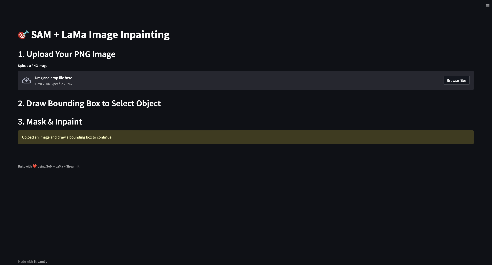
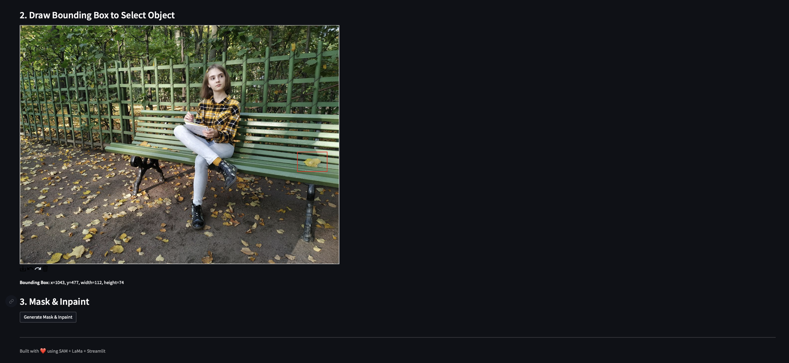
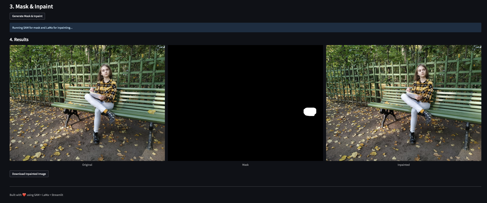

# Object Removal Using LaMa + Segment Anything

This project combines the power of **Meta AI's Segment Anything (SAM)** with **LaMa (Look-at-the-mask)** inpainting to enable **seamless object removal** from images using intelligent masks.

Built with:
- ⚙️ **SAM** for zero-shot object segmentation via interactive bounding box
- 🎨 **LaMa** for high-quality, deep learning-based image inpainting
- 🖥️ Streamlit for a clean and simple web-based UI

---

## User Interface of Streamlit


Below is the step-by-step interface for object removal using the app:

### 1️⃣ Initial UI


### 2️⃣ Upload image


### 3️⃣ Selecting object to remove (Bounding Box)


### 4️⃣ Result + download button



### [Click here to download the sample inpainted image](download_img/inpainted.png)
---

## Project Structure


```
lama_sam_project/
├── lama/
│   ├── configs/
│   ├── fetch_data/
│   ├── saicinpainting/
│   └── LICENSE
├── app.py
├── predict_wrapper.py
├── test_predict_wrapper.py
├── requirements.txt
├── .gitignore
├── README.md
├── images/               # Screenshots for documentation
└── download_img/         # Stores final inpainted images temporarily
```

---

## How to Run

### 1️⃣ Clone the Repo
```bash
git clone https://github.com/your-username/lama_sam_project.git
cd lama_sam_project
```

### 2️⃣ Set Up Environment
We recommend using **conda**:

```bash
conda create -n lama_sam_env python=3.10
conda activate lama_sam_env
pip install -r requirements.txt
```

### 3️⃣ Download Required Weights

LaMa and SAM require external pretrained weights:

| Model | File | Download Link | Where to Place |
|-------|------|----------------|----------------|
| SAM   | `sam_vit_h_4b8939.pth` | [Download](https://drive.google.com/your-sam-link) | `./segment_anything/` |
| LaMa  | Entire folder | [Clone Official Repo](https://github.com/advimman/lama) | Use only `configs/`, `fetch_data/`, `saicinpainting/` |

---

### 4️⃣ Run the App

```bash
streamlit run app.py
```

The Streamlit UI allows you to:
- Upload an image
- Select the object to remove via bounding box
- Preview and download the inpainted result

---

## How It Works

1. **SAM** detects the object mask using your bounding box
2. The mask is **dilated** and **blurred** for smoothness
3. **LaMa** takes the image and mask to perform high-fidelity inpainting
4. Result is displayed and downloadable via UI

---

## What’s Ignored (Not Pushed to GitHub)

To keep the repo clean, large or unnecessary components are **excluded**:
- `segment_anything/` and `sam_vit_h_4b8939.pth` → [See download instructions above](#3️⃣-download-required-weights)
- `lama/LaMa_models/`, `lama/models/`, `lama/outputs/`, `lama/docker/`, `lama/bin/`
- `.npy`, `.pt`, `.ckpt` files
- Intermediate debug outputs

---

## Future Enhancements

- Add mask-editing (eraser/brush) post-SAM
- GPU support toggle
- Option to save masks for future reuse

---

## 📄 License

This project inherits the LaMa license from [advimman/lama](https://github.com/advimman/lama).  
SAM is from [Meta AI](https://github.com/facebookresearch/segment-anything).

---

## Acknowledgements

- [Segment Anything by Meta AI](https://github.com/facebookresearch/segment-anything)
- [LaMa Inpainting by SAIC](https://github.com/advimman/lama)

---

## Author

**Siddharth**  
For questions or collaborations, reach out at [mllsiddharth@gmail.com].
